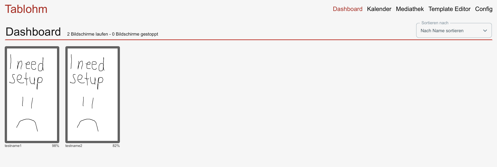
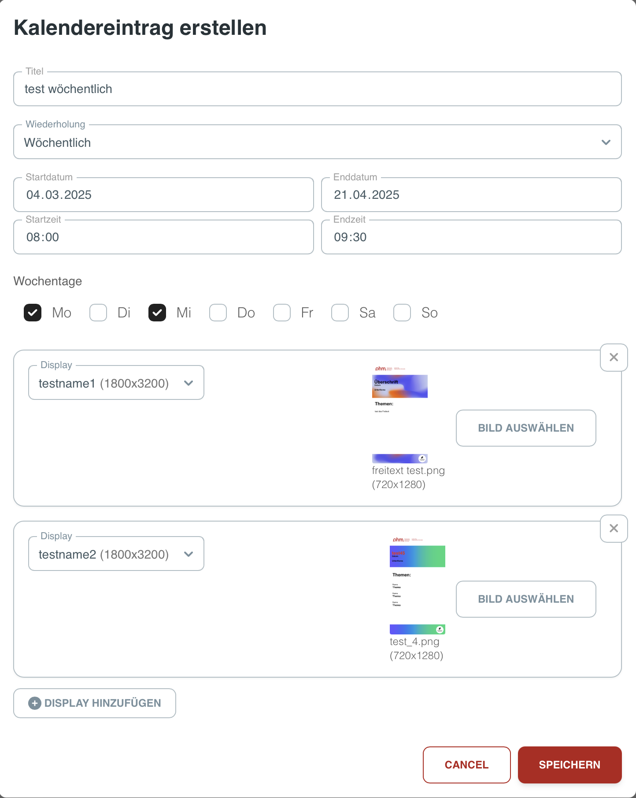

# 📘 Website-Tutorial

Dieses Tutorial bietet einen Überblick über die Website und erklärt wie die einzelnen funktionen genutzt werden können.

## 📌 Inhaltsverzeichnis
- [Dashboard](#dashboard) – Überblick über alle Displays
- [Kalender](#kalender) – Termine verwalten
- [Mediathek](#mediathek) – Bilder verwalten
- [Template Editor](#template-editor) – Neue Vorlagen erstellen 
- [Config](#config) – Konfigurationseinstellungen 

---

## 🖥️ Dashboard 
Das Dashboard bietet dir einen schnellen Überblick über alle Displays.

### Funktionen:
- **Bild-Anzeige** – Auf dem Dashboard werden die aktuellen Bilder auf den Displays angezeigt.   
- **Display Informationen** – Nach einem Klick auf ein Display öffnet sich ein Menü auf dem diverse Informationen wie der Akkustand, der Aufweckzeitpunkt, der Zeitpunkt des nächsten Events usw. dargestellt werden.
- **Display Setup** – Das Dashboard bietet die Möglichkeit neue Displays zu konfigurieren.   
- **Fehlermeldungen** – Auf dem Dashboard erscheinen Hinweise, wenn Fehler aufgetreten sind. 

> **Hinweis:** Über das "Sortieren nach" Drop-Down Menü lässt sich einstellen, ob die Displays nach ihrem Namen soertiert werden, 
> oder ob man die Sortierung manuell per drag and drop vornehmen möchte.".

### Display-Setup:
- **Display-Registrierung** – Neue Displays regsitrieren sich automatisch von selbst bei dem Server. 
Anschließend sind sie auf der Dashboard-Seite neben den bereits bestehenden Displays zu sehen.  
- **Display-Koniguration** – Klicken Sie zunächst auf das zu konfigurierende Display. Klicken Sie anschließend 
in dem Informations Menü auf den "Edit Display" Button. Nun erscheint ein Dialog über den das Display Konfiguriert werden kann.
- Name: Der Name des Displays
- Displaymarke: Die Marke des Display
- Displaymodell: Das Modell
- Orientierung: Die Orientierung, wie das Display aufgehängt wurde (vertikal oder horizontal)
- Breite: Die Displaybreite (wird in der Regel schon von dem Display selber bei der Registrierung angegeben)
- Höhe: Die Displayhöhe (wird in der Regel schon von dem Display selber bei der Registrierung angegeben)
- Standardbild: Hier kann man das Bild auswählen, das angezeigt werden soll, wenn gerade kein Termin stattfindet.

> **Hinweis:** Bei der Bilderauswahl werden automatisch die jenigen Bilder aus der Mediathek angezeigt, deren Seitenverhältnis zu dem des Displays passt.

### Fehlermeldungen:
- Wenn ein Fehler bei einem Display vorliegt, wird in der rechten oberen Ecke ein gelbes Warndreieck eingebelendet. 
Dieses Warn-Symbol ist nur im Dashboard zu sehen, nicht aber auf den tatsächlichen physischen Displays.
- Nach einem Klick auf das entsprechende Display öffnet sich das Display Informationsmenü. In diesem stehen kurze beschreibungen aller aktuellen Fehler, die dieses display betreffen.

---

## 📅 Kalender 
Diese Seite dient der Anzeige und Verwaltung von Terminen.

### Funktionen:
- **Termine filtern** – Termine werden im Kalender dargestellt. Über die Checkboxen lassen sich Termine nach zugeteilten Displays filtern. 
- **Erstellen neuer Termine** – Nach einem klick auf ein beliebiges Feld in den Kalender, öffnet sich ein Menü zum erstellen eines neuen Termines. 

- **Löschen & Bearbeiten von Terminen** – Nach einem klick auf einen Termin, öffnet sich ein Menü, über welches diser gelöscht oder bearbeitet werden kann.

  

> **Hinweis:** Sich wiederholende Termine können entweder einzeln oder gemeinsam gelöscht werden, aber nur einzeln bearbeitet werden.

---

## 📂 Mediathek 
Verwalte die Bilder der Mediathek. Bevor ein Bild als Standardbild oder in einem Termin verwendet werden kann, muss es zunächst in die Mediathek hochgeladen werden.

### Funktionen:
- **Hochladen von Bildern** – Nach einem klick auf den "Hochladen" Button öffnet sich ein entsprechendes Dialog-Menü 
- **Sortieren von Bildern** – Die Bilder lassen sich nach dateiname oder nach uploaddatum sortieren.
- **Löschen von Bildern** – Wenn man mit der Maus über ein bild hovert, erschein ein "X" in der oberen rechten Ecke. 
Klickt man auf dieses "X" öffnet sich ein Dialog zur Bestätigung das dieses Bild gelöscht werden soll.

  

> **Hinweis:** Die maximal zulässige Dateigröße für den Upload beträgt 10 MB.

---
 
## 🎨 Template Editor 
Der Template Editor dient zur Erstellung von neuen Bildern für die Mediathek.

### Funktionen:
- **Beliebiges Hintergrundbild hochladbar**  
- **Hinzufügen von Textfeldern an beliebiger Position** – Textfelder können durch einen einfachen doppelklick in dem Bild platziert werden. Die Textfelder lassen sich aiuch im nachhinein noch verschieben. 
- **Schriftart, Schriftgröße und Schriftfarbe einstellbar** – Nach dem das gewünschte Textfeld angeklickt wurde, können Schriftart (Arial, Helvetica, Times New Roman, Courier New) Schriftgröße und Schriftfarbe verändert werden. Außerdem lässt sich die Schriftgröße auch verändern, indem das Textfeld größer gezogen wird.
- **Editiertes Bild in Mediathek speichern** – Nach dem das Bild editiert wurde, kann es nach einem Klick auf den "Bild speichern" Button gespeichert werden. Dieser befindet sich unter dem Bild. Anschließend erscheint ein kleiner Dialog zur Benennung des Bildes.

---

## ⚙️ Config 
Hier lassen sich diverse Konfigurationseinstellungen treffen. Nach einem klick auf den "Speichern" Button werden die Änderungen übernommen.

### Funktionen:
- **Wochentage** – Über die Checkboxen lässt sich einstellen, an welchen Tagen sich die displays automatisch periodosch aufwecken sollen um vom Server abzufragen ob neue Termine geplant wurden.
- **Start- und Endzeit** – In welchem Zeitraum sich die Displays periodisch aufwecken sollen, um nach neuen Terminen zu fragen.
- **Aufweck-Intervall** – Die Anzahl in Minuten, nach denen sich die Displays automatisch wieder aufwecken sollen, um nach neuen Terminen zu fragen.
- **Vorlaufzeit** – Die Anzahl der Minuten, die der Bildwechsel vor dem beginn des eigentlichen Termin angestoßen werden soll.
- **Nachlaufzeit** – Die Anzahl in Minuten, die der Bildwechsel nach der Beendigung des Termines stattfinden soll 
- **Tage bis zur Löschung ungenutzter Bilder auf den Displays** – Die verwendeten Bilder werden jeweils auch lokal auf den Displays gespeichert, damit diese angzeigt werden können. Nach der hier angegebenen Anzahl an Tagen werden ungenutzte Bilder wieder von den Displays entfernt, damit der Speicher nicht volläuft. (In der Mediathek bleiben hochgeladene Bilder selbstverständlich erhalten)

💡 **Hinweis:** Die Vor-und Nachlaufzeiten werden ignoriert bzw. gekürzt, wenn zwei aufeinander folgenden Termine so nahe hintereinander liegen, dass die Vor- und Nachlaufzeit nicht vollständig ausgeführt werden können!

---